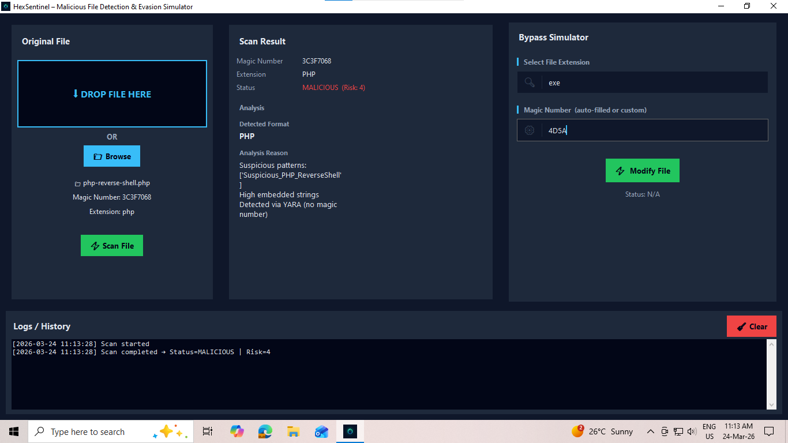

# 🛡️ HexSentinel - File Signature & Malware Detection Tool

A cross-platform malicious file detection and analysis tool that identifies potential threats using **magic number validation**, **file extension analysis**, and **heuristic checks**, along with a **bypass simulation module** to study evasion techniques used in real-world scenarios.

---

## 🔍 Features

* 📂 File scanning using **magic numbers**
* 🧬 Detection of **extension vs content mismatches**
* ⚔️ **Bypass Simulation** (manual modification of magic numbers & extensions)
* 🖱️ Drag & Drop file support
* 🎨 Modern dark-themed UI
* 🌐 Cross-platform support (Linux & Windows)
* 📊 Real-time analysis results
* 🧪 Designed for cybersecurity learning and CTF practice

---

## 🎥 Demo

👉 Watch the demo here:
[HexSentinel - Malicious File Detection Tool](https://www.youtube.com/watch?v=-M2KmCVCNyo)

---

## 🖼️ Screenshot



---

## ⚙️ Installation

### 🐧 Linux / Kali (Development Mode)

#### 1. Install required system package

```bash
sudo apt install python3-venv
```

#### 2. Create virtual environment

```bash
python3 -m venv .venv
```

#### 3. Activate virtual environment

```bash
source .venv/bin/activate
```

#### 4. Install dependencies

```bash
pip install -r requirements.txt
```

#### 5. Run the application

```bash
python main.py
```

---

### 🐧 Linux (Package Installation - .deb)

#### 1. Install dependency

```bash
sudo apt-get install tkdnd
```

#### 2. Install package

```bash
sudo dpkg -i hexsentinel_1.0.deb
```

---

### 🪟 Windows (Setup Installer)

* Download the **setup installer (.exe)**
* Run the installer and follow the installation steps (like any other software)
* After installation, launch the application from the Start Menu or Desktop shortcut

---

## 📦 Requirements

* Python 3.8+
* Tkinter
* tkinterdnd2
* customtkinter

Install dependencies:

```bash
pip install -r requirements.txt
```

---

## 🧠 How It Works

HexSentinel analyzes files using:

### 🔹 1. Magic Number Analysis

Detects file type based on binary signatures (file headers).

### 🔹 2. Extension Validation

Compares file extension with actual content to detect mismatches.

### 🔹 3. Heuristic Analysis

Applies rule-based checks to identify suspicious file behavior.

### 🔹 4. Bypass Simulation

Allows controlled simulation of evasion techniques by modifying:

* File magic numbers
* File extensions

This helps in understanding how attackers attempt to bypass detection systems.

---

## 📁 Project Structure

```
HexSentinel/
│
├── main.py
├── requirements.txt
├── README.md
├── LICENSE
├── .gitignore
│
├── core/          # Detection logic & bypass engine
├── gui/           # User interface components
├── assets/        # Screenshots and resources
```

---

## 🤖 Development Approach

This project was developed using a combination of:

* Manual coding and implementation
* AI-assisted development using ChatGPT and Claude

AI tools were used to:

* Assist with debugging and code optimization
* Accelerate development of repetitive components
* Explore implementation approaches
* Improve structure and readability

All core logic, architecture decisions, and final implementation were designed, reviewed, and validated manually.

---

## ⚠️ Disclaimer

This tool is intended strictly for **educational and research purposes only**.

* Do NOT use it for malicious or unauthorized activities
* The author is not responsible for any misuse

---

## 🚀 Future Improvements

* Advanced behavioral analysis
* Integration with threat intelligence sources
* Machine learning-based detection
* Performance improvements
* Enhanced bypass detection techniques

---

## 📜 License

This project is licensed under the MIT License.

---

## 👨‍💻 Author

Prince Tyagi
Cybersecurity Student | CTF Player | Developer

---

## ⭐ Support

If you find this project useful:

* Star the repository
* Share with others
* Use it for cybersecurity learning
